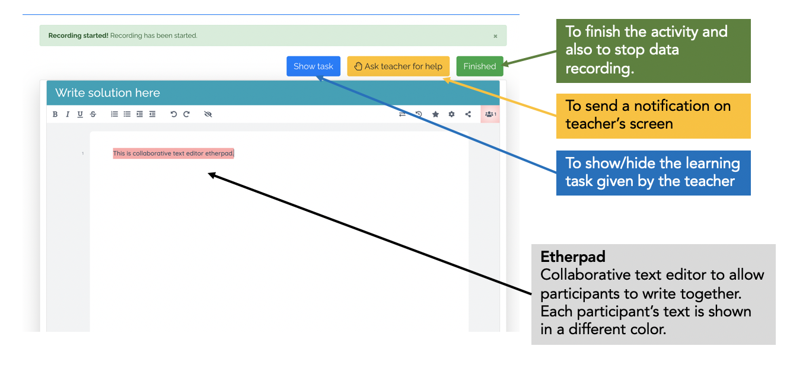
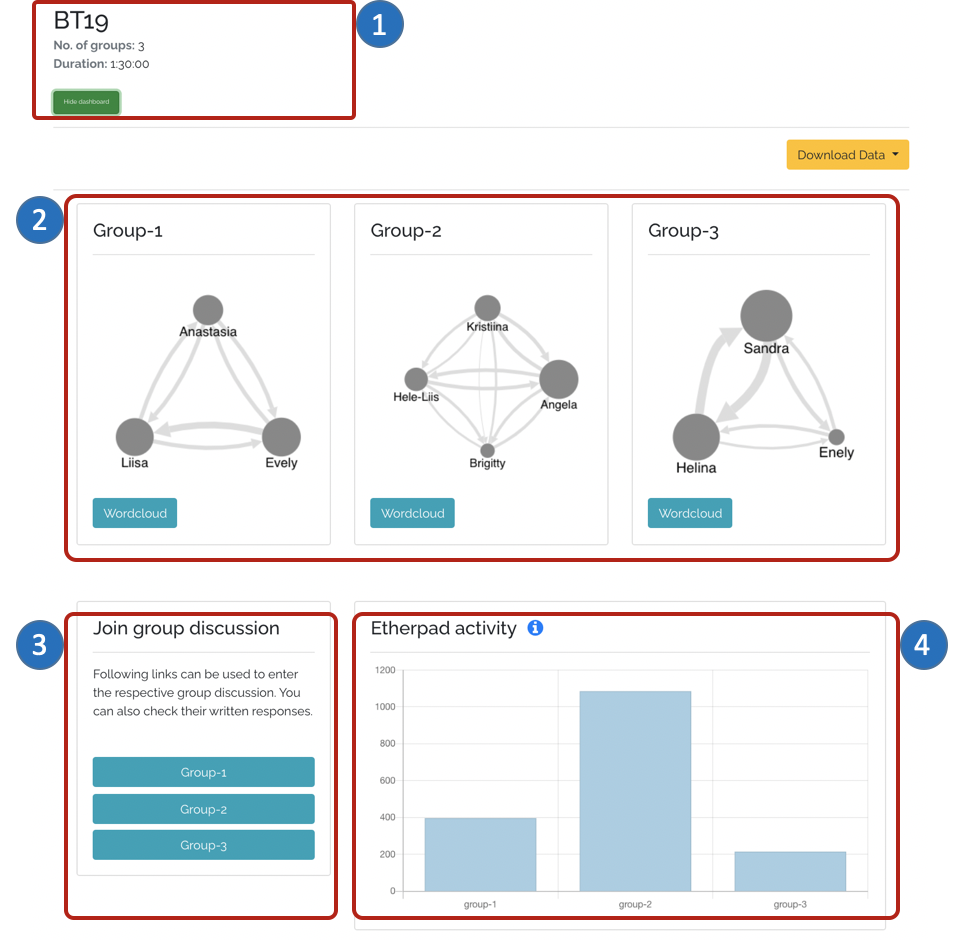
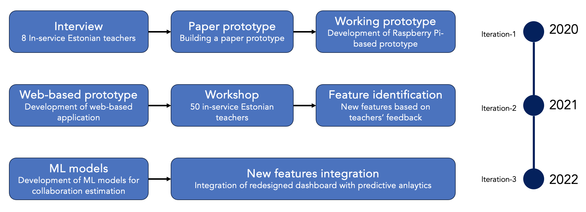
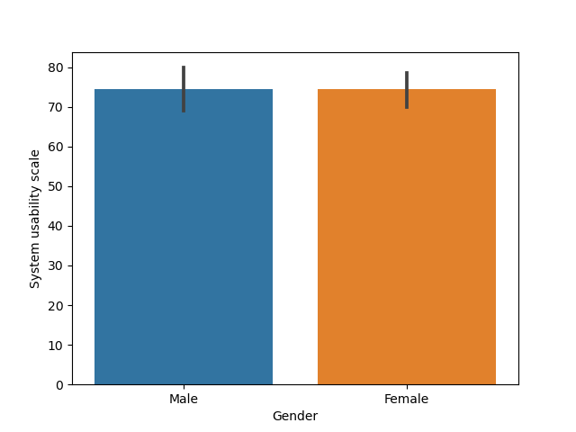
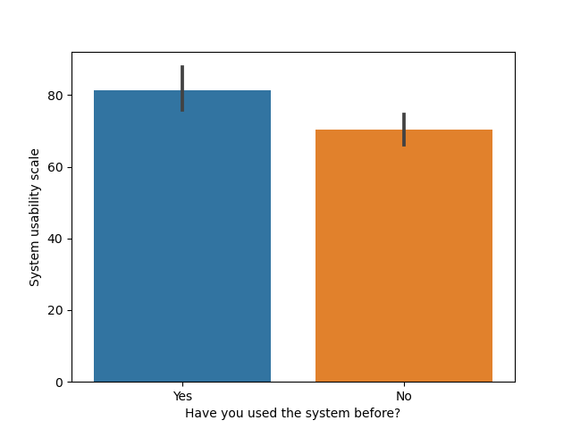

# Usability evaluation of CoTrack

This document offers information on the usability evaluation of a web-based application named CoTrack. The document first discusses CoTrack which is a web-based application for conducting group activity with monitoring functionality. Next, the document provides a detailed account of how the tool was evaluated with different stakeholders (e.g. Teachers, Students, Researchers) using SUS (System Usability Survey).

The results of this evaluation are presented in the Learning Analytics and Knowledge conerence.


> Pankaj Chejara, Reet Kasepalu, Luis P. Prieto, María Jesús Rodríguez-Triana,  and Adolfo Ruiz-Calleja. 2024. Bringing Collaborative Analytics using Multimodal Data to the Masses: Evaluation and Design Guidelines for Developing a MMLA System for Research and Teaching Practices in CSCL. In LAK24: 14th International Learning Analytics and Knowledge Conference (LAK 2024), March 18–22, 2024, Kyoto, Japan. ACM, New York, NY, USA, 10 pages. [https://doi.org/10.1145/3636555.3636877](https://doi.org/10.1145/3636555.3636877)


## CoTrack

CoTrack is a web application that allows teachers/researchers to organize group activities to implement a collaborative learning activity or collect multimodal data for research.


CoTrack utilizes Etherpad (a collaborative text editor) to allow group participants to write collaboratively. CoTrack tracks participants' writing contributions by processing logs from Etherpad. In addition, CoTrack can also be configured to record audio/video along with real-time processing of those data. For example, a teacher can configure CoTrack to extract participants' speaking behavior through speaking time, turn-taking, and speech-to-text data.


CoTrack makes it easy for teachers to add multimodal data tracking for monitoring their students' participation during collaborative learning activities in classrooms. Moreover, this ease of use also enables researchers from non-technical backgrounds to utilize the potential of multimodal data for their research.

### Technical Details of CoTrack

CoTrack has been developed using the Django framework. It uses [Etherpad](https://etherpad.org/) to offer a collaborative writing space to the group's participants. To track the participants' writing activities, CoTrack uses Etherpad's REST API to fetch writing logs.

CoTrack consists of five main modules: Fetcher, Preprocessing, Storage, Visualisation, and Prediction.


* The **Fetcher** serves two primary purposes: firstly, it includes a REST API interface to interact with external applications; secondly, it offers an interface for user interaction. The current version of the system utilizes Etherpad, which is a collaborative text editor, to provide a collaborative working space for users. The figure below shows the collaborative area in the system. The Fetcher module is also responsible for retrieving multimedia files such as audio and video.



* - The **Preprocessing** module extracts features from multimodal data. Currently, the system supports speaking activity detection using the Voice Activity Detection algorithm, speech-to-text translation using the Google Speech-To-Text API, and processing of log features obtained from Etherpad. All these features are extracted in real-time.
  - The **Storage** module is responsible for saving multimedia files and preprocessed features. The module stores audio and video files in WEBM format.
  - The last two modules, **Visualisation** and **Prediction**, leverage the extracted features to generate real-time dashboards of students' activities and to estimate collaboration quality. The figure below shows a dashboard generated from a dataset collected from an authentic classroom setting. The dashboard provides insights into group speaking behavior, displays speech content in the form of a word cloud, and presents writing contributions from each group. In addition, the system also offers the downloading of synchronized and anonymized multimodal data in CSV format for research purposes as well as downloading the responses from all groups into a single file for the teacher.

CoTrack (1: basic details of learning activity; 2: group's speaking behavior in terms of 'who is talking after whom'; 3: controls to check groups' response; 4: each group's contributions in terms of updates made in the editor)

Image: Flaticon.com

The figure has been designed using images from Flaticon.com.

### Development methodology

This section presents the methodology employed for the design and development of the proposed system. The presented system has been co-designed and developed over the duration of three years (2020-2022) in three major iterations involving a total of **58 teachers, 603 students, and 6 researchers**. The following subsections offer a detailed description of those three iterations.

#### Iteration-1

The first iteration involved interviewing Estonian teachers and the development of a paper and a working prototype. We interviewed 8 in-service Estonian teachers and asked them what kind of information could help them before, during, or after collaborative learning.

This step provided us with ideas on the \textit{teachers' preferences}, e.g., the teachers were interested in the individual contribution of the students in each group, their conversation topic, etc.

In the next step, we first prepared a paper prototype which then developed into a working prototype using a Raspberry Pi board. The working prototype was equipped with a microphone array that detected the direction of the sound, e.g., whenever a student spoke, the prototype detected voice activity in a specific direction which was then used to identify the speaker. However, this version had several \textit{limitations}, Firstly, it required a technical person to set up the devices and start the servers (Etherpad, MQTT) for data collection. Secondly, the use of this prototype was not possible for learning happening in online settings which became a norm during the COVID-19 pandemic.

#### Iteration-2

In the second iteration, we addressed the aforementioned issues we encountered with the use of the first working prototype. We developed a web-based version, which enabled easier access to the prototype. We also integrated a real-time dashboard for monitoring the groups' activities in the classroom.

We used the developed prototype in a workshop to gain feedback from 50 Estonian teachers (32 teachers were in-service English language teachers and 18 were IT teachers). The *feedback* from teachers enabled us to identify new functionalities for the system, e.g., the need to indicate collaboration quality, a feature to duplicate already created learning activities, and automation of group formation.

Students accessed the system on their laptops using the Google Chrome browser. There was no additional setup needed to use CoTrack. The web-based version allowed teachers to create group activities with a monitoring functionality without the need for a technical expert. This iteration resulted in the identification of other *limitations*, e.g., high-frequency multimodal data caused the server to perform a high number of disk-write operations to save data; there was a lack of support for stakeholders to download processed multimodal data.

#### Iteration-3

In the third iteration, we addressed the aforementioned technological issues in addition to integrating the teachers' suggestions with a prediction system to offer an indication of the groups' collaboration quality. As a part of this iteration, we developed machine learning models with a larger dataset, which were collected from two different Estonian schools to classify collaboration quality and its underlying dimensions, e.g., argumentation, knowledge exchange, and sustaining mutual.

This iteration helped us to identify the need for a guidance system that can offer some suggestions on the potential intervention strategies.

### Addressing challenges of multimodal data collection

CoTrack tries to tackle challenges associated with multimodal data collection, e.g., data preprocessing, data synchronization, and data anonymization. The following offers more information on how CoTrack addresses these various challenges.

- **Data Synchronization** CoTrack collects audio, video, and log data. The effective utilization of these data requires these data to be synchronized. To achieve this CoTrack uses [the ServerDate library](https://github.com/NodeGuy/server-date). This library enables the usage of the server's clock on the client's side. As a consequence, all the recorded/pre-processed data share a common timestamp. This removes the need to manually synchronize data before using it for research purposes.
- **Data Anonymization** CoTrack performs data anonymization by replacing each user's identifier with an anonymized string. Hence, when the researcher or teacher downloads the pre-processed data from CoTrack, the data contains an anonymized identifier.
- **Data Pre-processing** CoTrack performs data pre-processing in real-time which further enables the tool to generate a dashboard for teachers. The current version of CoTrack processes audio and log data. To process audio data, CoTrack uses Voice Activity Detection (VAD) to detect speaking activity which is later used to compute speaking time and turn-taking features. CoTrack also uses Google Speech-To-Text API to obtain speech data.
- **Data Recording** CoTrack supports the recording of audio or video data for research purposes. CoTrack performs data recording in two ways: first, it records data in chunks (every 5 minutes) and sends it to the server; second, it also sends a final file upon completion of the activity to the server. In this way, CoTrack minimizes the chance of data missing due to reasons, e.g., network delay.

## Usability Evaluation

To assess the usability of CoTrack, we utilized a widely used survey instrument (i.e., System Usability Survey). In total, two researchers (R1, R2) and two teachers (T1, T2) used the system for research and teaching purposes. In addition to obtaining the responses of teachers/researchers, we also collected responses from students from the classroom where the teacher (T1) used the system.


### Participants

We want to emphasize that the system has been used by a total of **58 teachers, 603 students, and 6 researchers**. However, this study only presents the responses from 2 teachers, 2 researchers, and 24 students. We are still in the process of collecting and processing survey responses from other users of CoTrack.

We provide further information on researchers/teachers below.

- **Researcher: R1**

The first researcher was a Ph.D. student (female) having a computer science background from a Spanish university who used the system for collecting audio data from an authentic classroom setting. The research study was conducted bi-weekly throughout two undergraduate courses on computer networks in 2021. There were a total of 33 students who participated in the study. The goal of the research was to explore students' socially shared regulation of learning in collaborative learning activities.

- **Researcher: R2**

The second researcher was an educational technology master student (female) with a primary teaching background from an Estonian university. This means that contrary to R1, R2 had a non-technical background. R2 closely interacted with Estonian teachers and collected data from authentic classroom settings using our system in 2022. The goal of the study was to investigate the impact of using MMLA systems during collaborative learning on students' subject knowledge and collaboration skills.

- **Teacher: T1**

The first teacher (female) was from a vocational school in Estonia who used the system in her classrooms for enacting and monitoring group activities in autumn 2023. The teacher had a pedagogical non-technical background. The participants were students, mostly 18-20 years old, enrolled in a software development curriculum.

- **Teacher: T2**

The second teacher (male) was from an Austrian university and used the system in his classroom in autumn 2023. The students were enrolled in a master's program in e-education. The goal of using the system was to illustrate an example of utilizing (MM)LA tools. Contrary to the first teacher (T1), T2 had a technical background.

We also collected students' responses on CoTrack's usability. The students were from T1's classroom session where CoTrack was used.

- **Students**

There were a total of 24 students (19 male, 5 female) who used CoTrack in two classroom lessons. In one lesson the students were asked to complete two activities: the first activity was to go over the class rules from the previous year and analyze them in regards to their functionality and whether there was a need to incorporate some changes into the agreements; the second activity was to plan a group hike day and brainstorm potential group activities for the upcoming school year. In the other lesson, the students were asked to do a vocabulary solidification activity in small groups of three. The students first needed to decide which newly acquired vocabulary was to be used in a gapped sentence and then they needed to discuss how they could use the new vocabulary to write about their personal experiences. In both of the lessons, the students were asked for consent before using the system and T1 introduced the system and informed students about the data it collects. At the end of the activity, the students responded to the SUS survey. It is important to note that the students in the former lesson did already have prior experience using the system while the students from the latter lesson were first-time users of the system.

### Results

**Overall SUS score**

* **Students** 74.4 (10.8)

* **Researchers**
  
  R1 75
  
  R2 80

* **Teachers**
  
  T1 75
  
  T2 47.5

**Difference in score based on gender**

There were more male (N=21) participants than female (N=7). The scores were same for both gender. 



**Difference in score based on prior experience**

The students with prior experience of using CoTrack gave it a higher score compared to those who used it the first time. This could be due to the learning curve associated with the use of CoTrack. Though it is designed to be used easily it still requires participants to be familiar with its functioning.


```python

```
